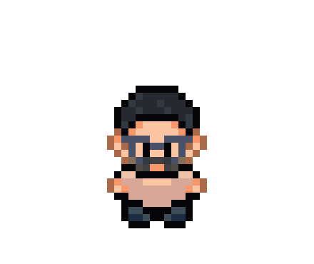

   
  <h1>Hi there 👋, I'm Freddy   
    <picture> 
      <source srcset="https://readme-typing-svg.demolab.com?&pause=2000&color=F7F7F7&center=true&vCenter=true&height=26&lines=A+Web+Developer+in+making;A+Videogame+Developer;A+passionate+learnig+developer" alt="Typing SVG" 
                media="(prefers-color-scheme: dark)"/> 
      <source srcset="https://readme-typing-svg.demolab.com?&pause=2000&color=000000FF&center=true&vCenter=true&height=26&lines=A+Web+Developer+in+making;A+Videogame+Developer;A+passionate+learnig+developer" alt="Typing SVG" 
        media="(prefers-color-scheme: light), (prefers-color-scheme: no-preference)"/> 
       
    </picture> 
  </h1> 

 
  

 
  
 
    <picture>
      <source srcset="https://github-readme-stats.vercel.app/api?username=A1ebyte&show_icons=true&theme=dark&bg_color=00000000" media="(prefers-color-scheme: dark)"/> 
      <source srcset="https://github-readme-stats.vercel.app/api?username=A1ebyte&show_icons=true&bg_color=00000000" media="(prefers-color-scheme: light), (prefers-color-scheme: no-preference)"/> 
       
    </picture> 
  

 
<!--<h3 align="left">Connect with me:</h3> 
 
--> <!-- **A1ebyte/A1ebyte** is a ✨ _special_ ✨ repository because its `README.md` (this file) appears on your GitHub profile. Here are some ideas to get you started: - 🔭 I’m currently working on ... - 🌱 I’m currently learning ... - 👯 I’m looking to collaborate on ... - 🤔 I’m looking for help with ... - 💬 Ask me about ... - 📫 How to reach me: ... - 😄 Pronouns: ... - ⚡ Fun fact: ... -->
